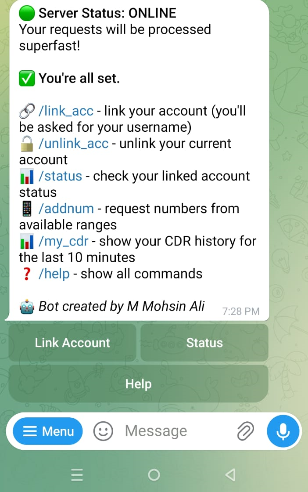
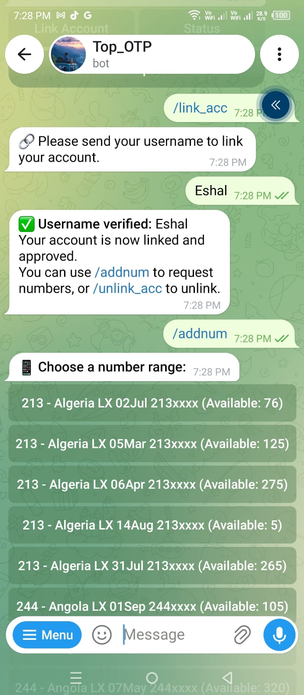
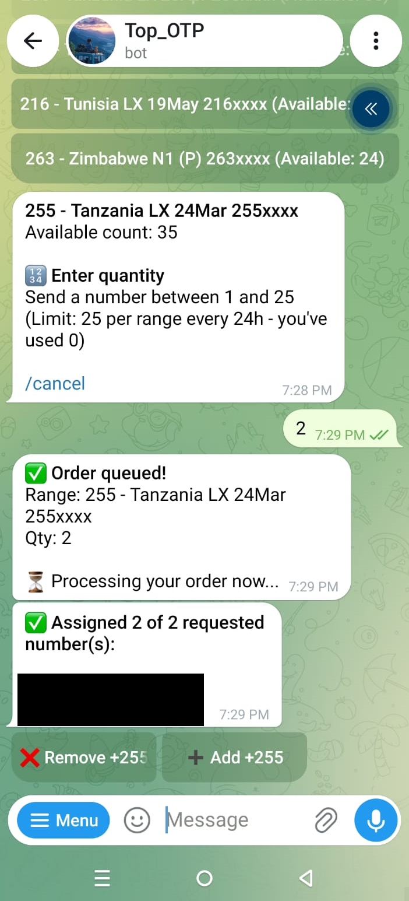
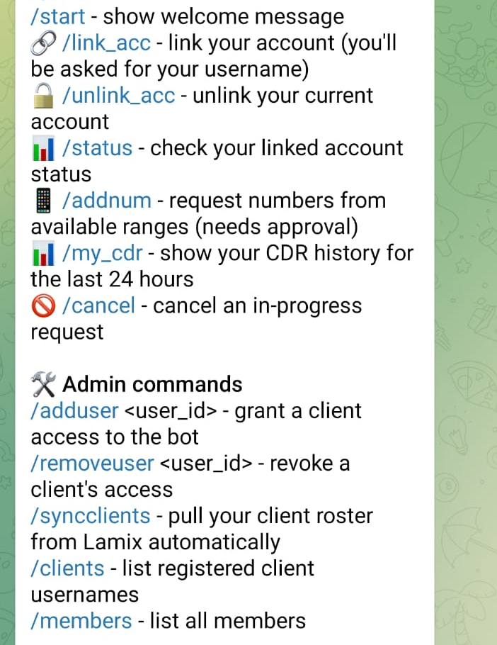

# Telegram Bot — SMS Panel Reseller Integration

A production Telegram bot that lets an SMS-reselling agent's clients self-serve number allocation, view their own CDR history, and receive a live traffic feed — all backed by a real third-party REST API (Lamix SMS panel). Built end-to-end: bot logic, database design, background job scheduling, and production deployment.

## Screenshots

| Welcome menu | Live range picker |
|---|---|
|  |  |

| Number request completed | Full command list |
|---|---|
|  |  |

*(Real phone numbers redacted — the flow itself is shown live against production inventory.)*

## What it does

- **Client onboarding & access control** — allow-listing, account linking against a live client roster synced from the upstream API, auto-approval on successful link
- **Self-service number requests (`/addnum`)** — clients browse live inventory (grouped/ungrouped ranges), request a quantity, and get real MSISDNs assigned to their account via the panel's assign API — with a rolling 24h per-range quota enforced server-side
- **Personal CDR lookup (`/my_cdr`)** — a client can pull their own call/message history even though the upstream API has no "filter by client" endpoint on that resource; solved by resolving the client's held numbers once, then fetching and filtering agent-wide records with automatic time-window bisection to respect strict rate limits
- **Live traffic feed** — a background job polls new messages every 20s and posts each one individually to a public channel, with number masking and tap-to-copy inline buttons (Telegram's `CopyTextButton`)
- **Admin tooling** — allow-list management, client roster sync, member overview, bot-wide command menu (`setMyCommands`) scoped differently for admins vs. regular users

## Technical highlights

- **Rate-limit-aware API client** (`lamix_api.py`) — every endpoint call respects the upstream's per-endpoint burst/sustained limits; paginated endpoints (`/numbers`) are consumed via cursor, and unpaginated ones (`/cdrs`, capped at 500 records/call) are fetched via automatic recursive time-window bisection when a page comes back full
- **Persistence across restarts** — `PicklePersistence` for in-flight conversational state (so a mid-flow `/addnum` survives a process restart) plus a SQLite-backed cache (refreshed on a background job) for expensive per-client lookups that would otherwise take over a minute to recompute on every request
- **Defensive design from real production incidents** — e.g. a client turned out to hold 13,000+ numbers, which made a naive per-number CDR query loop take 8+ hours; the fix (batch time-window queries + client-side filtering) cut that to under 2 minutes
- **HTML-safe dynamic messages** — every piece of user- or API-sourced text is escaped before being interpolated into Telegram's HTML parse mode, avoiding `Bad Request: can't parse entities` failures
- **Background scheduling** via `python-telegram-bot`'s `JobQueue` (APScheduler under the hood) for the live traffic feed and periodic cache refresh, running alongside the main polling loop

## Tech stack

- **Python 3.10+**, [`python-telegram-bot`](https://github.com/python-telegram-bot/python-telegram-bot) (async, `JobQueue`, `PicklePersistence`)
- `httpx` for the upstream REST API client
- **SQLite** for all persistent state (members, allow-list, client roster, quota tracking, held-number cache)
- Deployed on a Linux VPS as a `systemd` service (auto-restart, survives reboots)

## Project structure

```
bot.py          — Telegram handlers, commands, background jobs, formatting
lamix_api.py    — thin, rate-limit-aware REST client for the upstream SMS panel API
db.py           — SQLite access layer (schema + queries)
config.py       — environment-based configuration
requirements.txt
.env.example    — documents every required environment variable
```

## Running it

```bash
python -m venv venv
./venv/bin/pip install -r requirements.txt
cp .env.example .env   # fill in your own values
python bot.py
```

For production, run it under a process supervisor — a sample `systemd` unit:

```ini
[Unit]
Description=Telegram Bot
After=network-online.target

[Service]
Type=simple
WorkingDirectory=/opt/telegram-bot
ExecStart=/opt/telegram-bot/venv/bin/python /opt/telegram-bot/bot.py
Restart=always
RestartSec=5

[Install]
WantedBy=multi-user.target
```
